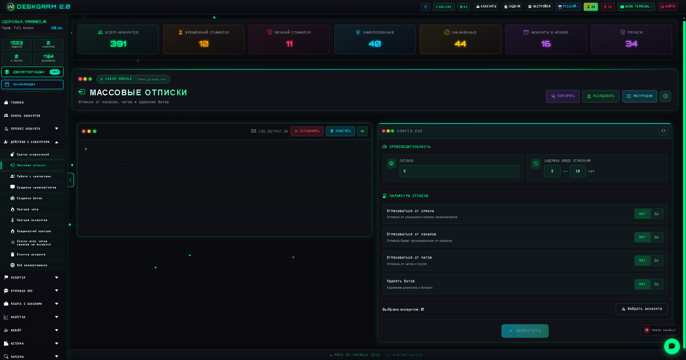
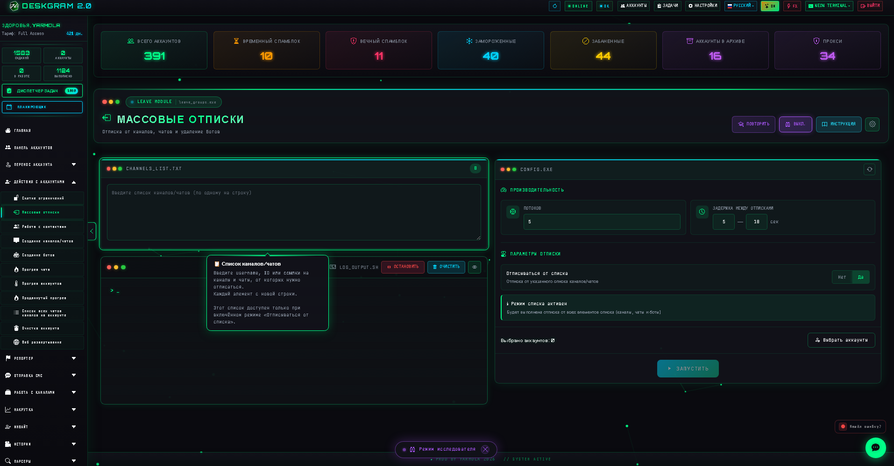
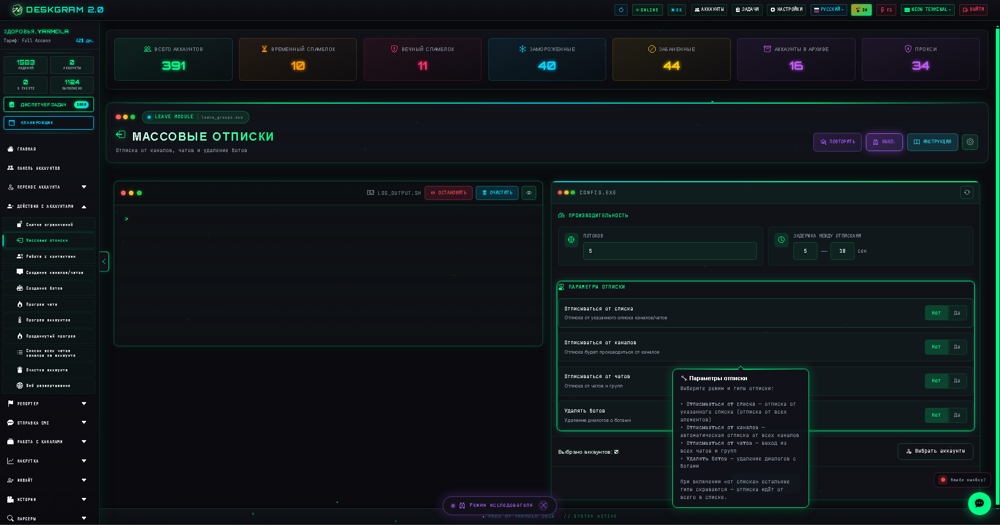
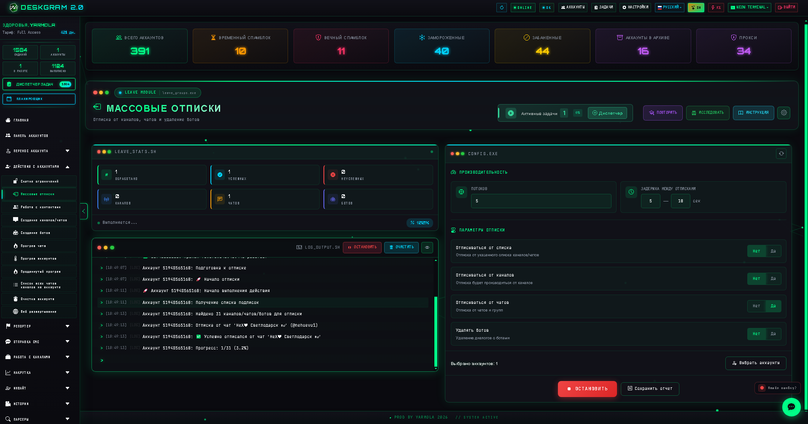

# Массовые отписки от Telegram-каналов и групп через Deskgram 2

Массовые отписки в Deskgram 2 помогают централизованно убирать Telegram-аккаунты из лишних каналов, чатов и папок. Этот сценарий полезен, когда нужно почистить инфраструктуру, освободить аккаунты перед новым use-case или аккуратно вывести сетку из старой среды без ручной рутины.

[Главный хаб Deskgram 2](https://github.com/Deskgram-2/deskgram-2-telegram-automation) · [Сайт](https://deskgram2.com/) · [Telegram-бот](https://t.me/DG2welcomebot) · [Web preview](https://deskgram2.com/web-preview?path=%2Fapp-demo%2F&lang=ru)

## Интерактивный Web Preview

Попробовать модуль в браузере: [Открыть веб-превью](https://deskgram2.com/web-preview?path=%2Fapp-demo%2Ffunctions%2Fleave_groups&lang=ru)

Если хотите сначала оценить сценарий без установки, откройте модуль в браузере и посмотрите, как устроены список источников, ограничения и статистика отписок.

## Скриншоты

## Кратко о модуле

| Параметр | Что внутри |
|---|---|
| Основная задача | Массовые отписки от каналов, групп и папок Telegram |
| Важные блоки | Список источников, статистика, логи, параметры отписки, ограничения |
| Полезен для | Очистки инфраструктуры, смены среды, подготовки аккаунтов к новым задачам |
| Связанные модули | Панель аккаунтов, Подписки, Прокси, Диспетчер задач |

## Что умеет модуль

- массово отписывать аккаунты от каналов и чатов;
- работать со списком ссылок и распределять их по аккаунтам;
- показывать статистику, логи и прогресс выполнения;
- задавать ограничения и рабочий темп;
- освобождать аккаунты перед следующими сценариями.

## Быстрый старт

1. Подготовьте список каналов, групп или папок, из которых нужно выйти.
2. Настройте параметры отписки и ограничения.
3. Выберите аккаунты и, при необходимости, прокси.
4. Запустите задачу и следите за статистикой.
5. После очистки переведите аккаунты в следующий рабочий модуль.

## С чем лучше сочетать

- [Панель аккаунтов](https://github.com/Deskgram-2/telegram-account-manager-deskgram), если сначала нужно собрать и отфильтровать рабочую группу аккаунтов.
- [Прокси](https://github.com/Deskgram-2/telegram-proxy-manager-deskgram), если инфраструктура работает через отдельный пул прокси.
- [Массовые подписки](https://github.com/Deskgram-2/telegram-join-groups-deskgram), если после очистки аккаунты нужно завести в новую среду.
- [Диспетчер задач](https://github.com/Deskgram-2/telegram-task-manager-deskgram), если важно отслеживать очистку как часть общей цепочки.

## Когда особенно полезен

- когда аккаунты нужно вывести из старых или нерелевантных сообществ;
- когда сетка готовится к новому нишевому сценарию;
- когда перед прогревом или подписками нужна чистая среда;
- когда ручная отписка уже не масштабируется.

## Сценарии применения

### Сценарий 1. Смена ниши или среды

Если аккаунты долго работали в одной теме, массовые отписки помогают быстро освободить их перед переходом в новую вертикаль или новый пул сообществ.

### Сценарий 2. Очистка перед прогревом и подписками

Этот модуль хорошо работает как подготовительный слой перед [массовыми подписками](https://github.com/Deskgram-2/telegram-join-groups-deskgram) и [прогревом аккаунтов](https://github.com/Deskgram-2/telegram-account-warmup-deskgram), когда нужно сначала убрать лишние связи.

### Сценарий 3. Возврат контроля над сеткой

Если инфраструктура разрослась хаотично, отписки помогают вернуть понятную структуру и подготовить аккаунты к новому циклу работы.

## Что выбрать: массовые отписки или массовые подписки

| Если задача такая | Лучше использовать |
|---|---|
| Нужно вывести аккаунты из старой среды | [Массовые отписки](https://github.com/Deskgram-2/telegram-leave-groups-deskgram) |
| Нужно завести аккаунты в новые каналы и чаты | [Массовые подписки](https://github.com/Deskgram-2/telegram-join-groups-deskgram) |
| Нужен маршрут `очистить -> завести заново` | Отписки, затем подписки |
| Нужна только подготовка аккаунтов к следующей волне задач | Массовые отписки |

## Смежные репозитории

- [Главный хаб Deskgram 2](https://github.com/Deskgram-2/deskgram-2-telegram-automation)
- [Панель аккаунтов](https://github.com/Deskgram-2/telegram-account-manager-deskgram)
- [Массовые подписки](https://github.com/Deskgram-2/telegram-join-groups-deskgram)
- [Прокси](https://github.com/Deskgram-2/telegram-proxy-manager-deskgram)
- [Диспетчер задач](https://github.com/Deskgram-2/telegram-task-manager-deskgram)
- [Прогрев аккаунтов](https://github.com/Deskgram-2/telegram-account-warmup-deskgram)

## FAQ

### Можно ли посмотреть интерфейс до установки?

Да. В README уже есть прямая ссылка на веб-превью, поэтому модуль можно открыть в браузере и понять, подходит ли вам этот сценарий до настройки инфраструктуры.

### Это отдельный сценарий или часть более длинной цепочки?

Чаще всего это инфраструктурный этап. Максимальную пользу модуль дает, когда после очистки вы переводите аккаунты в подписки, прогрев или другой рабочий маршрут.

### Когда отписки важнее, чем просто фильтрация аккаунтов?

Когда проблема именно в среде вокруг аккаунтов, а не в том, как они разложены по папкам. В таком случае одной [панели аккаунтов](https://github.com/Deskgram-2/telegram-account-manager-deskgram) мало, и нужна именно массовая очистка окружения.
